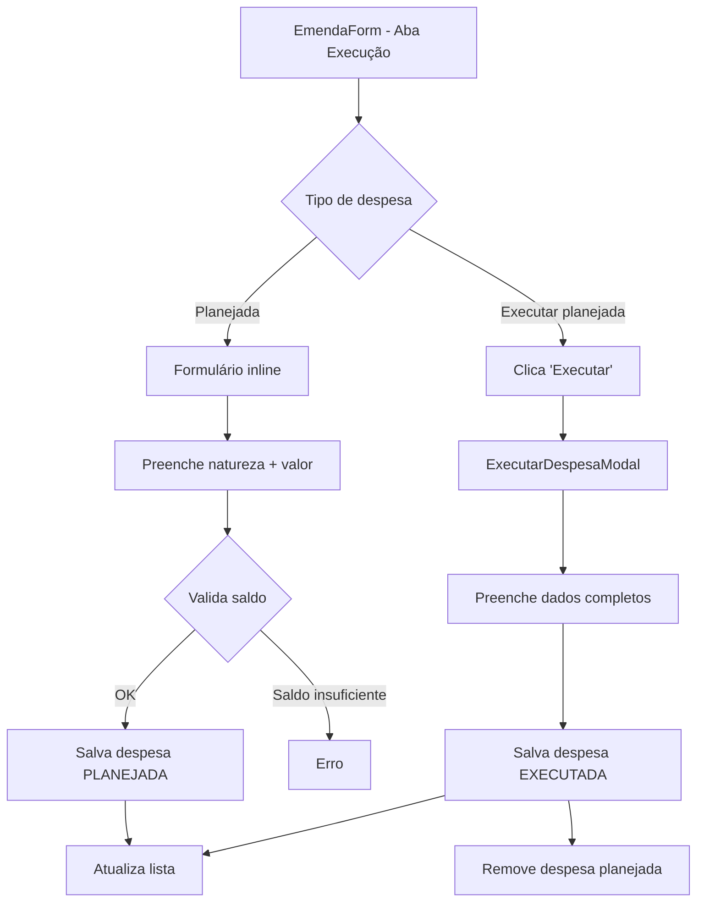

# 📋 ESTRUTURA COMPLETA DO SISTEMA DE EMENDAS

> **Gerado em:** 2025-01-05  
> **Versão do Sistema:** 2.3.78  
> **Objetivo:** Documentar toda a arquitetura, componentes, hooks, serviços e fluxos relacionados ao módulo de Emendas

---

## 📑 ÍNDICE

1. [Visão Geral](#visão-geral)
2. [Estrutura de Dados](#estrutura-de-dados)
3. [Componentes Principais](#componentes-principais)
4. [Formulário de Emenda](#formulário-de-emenda)
5. [Hooks Customizados](#hooks-customizados)
6. [Serviços e Utilitários](#serviços-e-utilitários)
7. [Fluxos de Navegação](#fluxos-de-navegação)
8. [Integrações](#integrações)

---

## 🎯 VISÃO GERAL

### Propósito
Gerenciamento completo de emendas parlamentares, incluindo:
- ✅ Cadastro e edição de emendas
- ✅ Visualização detalhada com métricas financeiras
- ✅ Integração com despesas e execução orçamentária
- ✅ Controle de saldo e execução
- ✅ Filtros e listagem paginada
- ✅ Permissões por município/UF

### Tecnologias
- **React** (componentes e hooks)
- **Firebase Firestore** (persistência)
- **React Router** (navegação)
- **Recharts** (visualizações)

---

## 📊 ESTRUTURA DE DADOS

### Schema da Emenda (Firebase)

```javascript
// src/utils/firebaseCollections.js
{
  // === IDENTIFICAÇÃO ===
  numero: "",              // Número único da emenda
  numeroEmenda: "",        // Nº DA EMENDA (duplicado para compatibilidade)
  cnpj: "",               // CNPJ do município
  municipio: "",          // Município beneficiário
  uf: "",                 // UF do município
  
  // === DADOS BÁSICOS ===
  programa: "",           // Programa orçamentário
  objetoProposta: "",     // Objeto da proposta
  autor: "",              // Parlamentar/Autor
  parlamentar: "",        // Mesmo que autor (compatibilidade)
  tipo: "",               // Tipo da emenda (Individual, Bancada, etc)
  tipoEmenda: "",         // OBJETO DA EMENDA
  numeroProposta: "",     // Nº DA PROPOSTA
  funcional: "",          // FUNCIONAL (classificação)
  
  // === FINANCEIRO ===
  valorRecurso: 0,        // VALOR DO RECURSO (R$)
  valor: 0,               // Valor total (compatibilidade)
  valorExecutado: 0,      // VALOR EXECUTADO DA EMENDA
  saldoDisponivel: 0,     // SALDO DISPONÍVEL (calculado)
  saldo: 0,               // Saldo (compatibilidade)
  
  // === BENEFICIÁRIO ===
  beneficiario: "",       // Nome/Razão Social
  beneficiarioCnpj: "",   // CNPJ do beneficiário
  
  // === DADOS BANCÁRIOS ===
  banco: "",              // Código do banco
  agencia: "",            // Agência
  conta: "",              // Conta
  
  // === CRONOGRAMA ===
  dataOb: "",             // DATA DA OB
  inicioExecucao: "",     // INÍCIO DA EXECUÇÃO
  finalExecucao: "",      // FINAL DA EXECUÇÃO
  dataValidade: "",       // Data de validade
  dataAprovacao: "",      // Data de aprovação
  dataUltimaAtualizacao: "", // DATA DA ÚLTIMA ATUALIZAÇÃO
  
  // === PLANEJAMENTO ===
  acoesServicos: [        // Metas quantitativas
    {
      estrategia: "",     // Natureza de despesa
      valorAcao: "",      // Valor planejado
      id: 0               // ID único
    }
  ],
  
  // === COMPLEMENTARES ===
  observacoes: "",        // Observações gerais
  status: "ativa",        // Status da emenda
  
  // === SISTEMA ===
  createdAt: null,        // Data de criação
  updatedAt: null         // Data de atualização
}
```

### Campos Calculados

```javascript
{
  // Calculados em tempo real
  percentualExecutado: 0,   // (valorExecutado / valorRecurso) * 100
  totalDespesas: 0,         // Contagem de despesas vinculadas
  totalMetas: 0,            // Contagem de metas planejadas
  
  // Arrays populados
  despesasVinculadas: [],   // Despesas desta emenda
  metasVinculadas: []       // Metas planejadas
}
```

---

## 🧩 COMPONENTES PRINCIPAIS

### 1. **Emendas.jsx** (Orquestrador Principal)
**Localização:** `src/components/Emendas.jsx`

**Responsabilidade:** Gerenciar a tela principal de emendas com listagem, filtros e ações.

**Props:** Nenhuma (componente rota)

**Estados Principais:**
- `emendas` - Lista de emendas carregadas
- `emendasFiltradas` - Resultado após aplicar filtros
- `loading` - Estado de carregamento
- `modalExclusao` - Controle do modal de exclusão

**Funcionalidades:**
- ✅ Carregamento de emendas com filtro por permissão
- ✅ Cálculo de execução baseado em despesas
- ✅ Integração com despesas para estatísticas
- ✅ Modal de confirmação de exclusão
- ✅ Navegação para edição/visualização

**Cálculos Importantes:**
```javascript
// Execução real baseada em despesas
const valorExecutado = despesasEmenda.reduce((sum, despesa) => {
  return sum + (parseFloat(despesa.valor) || 0);
}, 0);

const saldoDisponivel = valorTotal - valorExecutadoTotal;
const percentualExecutado = valorTotal > 0 
  ? (valorExecutadoTotal / valorTotal) * 100 
  : 0;
```

---

### 2. **EmendasList.jsx** (Listagem com Hook)
**Localização:** `src/components/EmendasList.jsx`

**Responsabilidade:** Listagem de emendas usando hook `useEmendaDespesa`.

**Props:**
- `usuario` - Dados do usuário logado
- `onNovaEmenda` - Callback para criar emenda
- `onEditarEmenda` - Callback para editar
- `onVisualizarEmenda` - Callback para visualizar
- `onExcluirEmenda` - Callback para excluir
- `onVerDespesas` - Callback para ver despesas

**Características:**
- ✅ Usa hook integrado para dados em tempo real
- ✅ Filtros automáticos por permissão
- ✅ Estatísticas financeiras consolidadas
- ✅ Componentes modulares (Header, Stats, Filters, Table)

---

### 3. **EmendasTable.jsx** (Tabela de Dados)
**Localização:** `src/components/EmendasTable.jsx` e `src/components/emenda/EmendasTable.jsx`

**Responsabilidade:** Renderizar tabela de emendas com colunas detalhadas.

**Props:**
- `emendas` / `emendasFiltradas` - Array de emendas
- `onEdit` - Editar emenda
- `onView` - Visualizar emenda
- `onDelete` - Excluir emenda
- `onDespesas` - Ver despesas (opcional)
- `userRole` - Papel do usuário

**Colunas Renderizadas:**
| Coluna | Descrição | Formatação |
|--------|-----------|------------|
| Número | Nº da emenda | Texto |
| Parlamentar | Autor/parlamentar | Texto |
| Emenda | ID da emenda | Badge |
| Objeto | Tipo de emenda | Badge |
| Município/UF | Localização | Texto composto |
| Valor Total | Valor da emenda | Moeda (R$) |
| Executado | Valor + percentual | Moeda + % |
| Saldo | Saldo disponível | Moeda (cores) |
| Despesas | Quantidade | Badge numérico |
| Válido até | Data de validade | Data formatada |
| Status | Status da emenda | Badge colorido |
| Ações | Botões de ação | Ícones |

**Ações Disponíveis:**
- ✏️ Editar (todos)
- 🗑️ Excluir (apenas admin)

---

### 4. **EmendasFilters.jsx** (Filtros de Pesquisa)
**Localização:** `src/components/EmendasFilters.jsx` e `src/components/emenda/EmendasFilters.jsx`

**Responsabilidade:** Interface de filtros para emendas.

**Props:**
- `emendas` - Lista completa
- `onFilterChange` - Callback com resultado filtrado
- `totalEmendas` - Total de emendas

**Filtros Disponíveis:**
1. **Parlamentar** - Busca por nome
2. **Número da Emenda** - Busca por código
3. **Município/UF** - Busca por localização
4. **Tipo de Emenda** - Seleção (Individual, Bancada, etc)

**Funcionalidades:**
- ✅ Aplicação automática de filtros
- ✅ Contagem de filtros ativos
- ✅ Botão limpar filtros
- ✅ Badge com total de resultados

---

### 5. **EmendasStats.jsx** (Estatísticas)
**Localização:** `src/components/emenda/EmendasStats.jsx`

**Responsabilidade:** Exibir resumo financeiro das emendas.

**Props:**
- `estatisticasGerais` - Objeto com métricas
- `loading` - Estado de carregamento

**Cards Exibidos:**
1. **Total de Emendas** - Quantidade
2. **Valor Total** - Soma de todos os valores
3. **Executado** - Total executado
4. **Saldo Disponível** - Saldo restante
5. **% Executado** - Percentual geral
6. **Com Saldo** - Emendas ativas

---

### 6. **EmendasListHeader.jsx** (Cabeçalho)
**Localização:** `src/components/emenda/EmendasListHeader.jsx`

**Responsabilidade:** Cabeçalho informativo da listagem.

**Props:**
- `usuario` - Dados do usuário
- `loading` - Estado de carregamento
- `totalEmendas` - Total de emendas
- `onVoltarDespesas` - Voltar para despesas (opcional)

**Informações Exibidas:**
- ✅ Status operacional
- ✅ Versão do sistema
- ✅ Tipo de usuário (Admin/Município)
- ✅ Total de emendas carregadas
- ✅ Banner de permissões para operadores

---

## 📝 FORMULÁRIO DE EMENDA

### Estrutura de Abas

#### **EmendaForm/index.jsx** (Orquestrador)
**Localização:** `src/components/emenda/EmendaForm/index.jsx`

**Abas Disponíveis:**
1. **Dados Básicos** - Informações principais
2. **Execução Orçamentária** - Planejamento e despesas

**Hooks Utilizados:**
- `useEmendaFormData` - Estado e lógica do formulário
- `useEmendaFormNavigation` - Navegação e modal de cancelamento

**Características:**
- ✅ Ações sempre inline (não sticky)
- ✅ Validação em tempo real
- ✅ Modal de cancelamento condicional
- ✅ Loading overlay durante salvamento
- ✅ Toast para feedback

---

### Aba 1: Dados Básicos

#### **DadosBasicosTab.jsx** (Container)
Agrupa todas as seções de dados básicos:
- Identificação
- Dados Básicos
- Dados Bancários
- Cronograma
- Informações Complementares

---

#### **Identificacao.jsx**
**Campos:**
- ✅ CNPJ (obrigatório, validado)
- ✅ UF (obrigatório, select)
- ✅ Município (obrigatório, carregado dinamicamente)

**Regras:**
- Admin: pode selecionar qualquer UF/município
- Operador: campos pré-preenchidos e bloqueados

---

#### **DadosBasicos.jsx**
**Campos:**
- ✅ Programa (obrigatório, select com constantes)
- ✅ Objeto da Proposta (obrigatório, min 10 chars)
- ✅ Parlamentar/Autor (obrigatório, min 3 chars)
- ✅ Número da Emenda (obrigatório, min 3 chars)
- ✅ Objeto da Emenda (obrigatório, select)
- ✅ Nº da Proposta (opcional)
- ✅ Funcional (opcional)
- ✅ Beneficiário - CNPJ (obrigatório, validado)
- ✅ Valor do Recurso (obrigatório, formatado como moeda)

---

#### **DadosBancarios.jsx**
**Campos:**
- ✅ Banco (obrigatório, código 3 dígitos)
- ✅ Agência (obrigatório, max 6 dígitos)
- ✅ Conta (obrigatório, max 15 chars)

**Extras:**
- Seção colapsível com códigos de bancos comuns

---

#### **Cronograma.jsx**
**Campos Obrigatórios:**
- ✅ Data de Aprovação
- ✅ Data OB
- ✅ Início da Execução
- ✅ Final da Execução
- ✅ Data de Validade
- ✅ Data de Última Atualização (automática)

**Validações:**
- Ordem cronológica
- Data OB após aprovação
- Final após início

**Visual:**
- Status colorido para cada campo
- Badge de resumo geral

---

#### **InformacoesComplementares.jsx**
**Seção Colapsível** (opcional)

**Campos:**
- Área de Atuação
- Telefone
- E-mail
- Modalidade de Aplicação
- Público-Alvo
- Número de Beneficiários
- Justificativa (textarea)
- Observações (textarea)

---

### Aba 2: Execução Orçamentária

#### **ExecucaoOrcamentaria.jsx**
**Responsabilidade:** Gerenciar planejamento (despesas planejadas) e execução (despesas executadas).

**Seções:**

##### 1. Banner de Contexto
- Valor total da emenda
- Total planejado
- Total executado
- Saldo disponível

##### 2. Despesas Planejadas
**Formulário Inline:**
- Natureza de Despesa (select + opção customizada)
- Valor (formatado como moeda)
- Botão "Adicionar"

**Validações:**
- Natureza obrigatória
- Valor > 0
- Saldo não pode ser negativo

**Tabela de Planejadas:**
- Natureza
- Valor Planejado
- Status (calculado vs executado)
- Ações: Executar / Excluir

##### 3. Despesas Executadas
**Tabela Completa:**
- Discriminação
- Fornecedor
- Empenho
- Nota
- Valor
- Datas
- Ações: Editar / Excluir

**Modal de Execução:**
Componente: `ExecutarDespesaModal.jsx`
- Dados da emenda (readonly)
- Dados básicos da despesa
- Classificação funcional
- Dados do empenho
- Dados do fornecedor
- Datas de execução

---

### Componentes de Suporte

#### **EmendaFormActions.jsx**
**Responsabilidade:** Barra de ações do formulário.

**Botões:**
- ⬅️ **Voltar** - Se formulário vazio
- ❌ **Cancelar** - Se formulário modificado (abre modal)
- 💾 **Salvar** - Sempre visível

**Lógica:**
```javascript
// Formulário vazio → Voltar
if (!hasUnsavedChanges) {
  <button onClick={handleVoltar}>← Voltar</button>
}

// Formulário modificado → Cancelar
if (hasUnsavedChanges) {
  <button onClick={handleCancel}>❌ Cancelar</button>
}
```

---

#### **EmendaFormCancelModal.jsx**
**Responsabilidade:** Modal de confirmação ao cancelar.

**Props:**
- `show` - Exibir modal
- `onClose` - Fechar modal
- `hasUnsavedChanges` - Tem alterações não salvas

**Comportamento:**
- Se tem alterações → Avisa sobre perda de dados
- Se não tem alterações → Confirma navegação

**Navegação:**
```javascript
// Forçar navegação direta
window.location.href = "/emendas";
```

---

#### **EmendaFormHeaderRich.jsx**
**Responsabilidade:** Cabeçalho rico com contexto da emenda.

**Informações:**
- Título (Criar/Editar)
- Breadcrumb (Número, Autor, Município)
- Cards contextuais (se editando):
  - Valor da Emenda
  - Total Planejado (se aba planejamento)
  - Saldo para Planejar
  - Total Executado (se aba despesas)
  - Saldo Disponível

---

#### **TabNavigation.jsx**
**Responsabilidade:** Navegação entre abas.

**Abas:**
1. 📋 Dados Básicos
2. 💰 Execução Orçamentária

**Comportamento:**
- Aba ativa com destaque visual
- Troca de aba preserva formulário

---

## 🪝 HOOKS CUSTOMIZADOS

### 1. **useEmendaFormData.js**
**Localização:** `src/hooks/useEmendaFormData.js`

**Responsabilidade:** Gerenciar todo o estado e lógica do formulário de emenda.

**Estados Retornados:**
```javascript
{
  // Dados
  formData,              // Objeto com todos os campos
  
  // Status
  loading,               // Carregando dados
  saving,                // Salvando
  error,                 // Erro geral
  isReady,              // Pronto para usar
  salvando,             // Salvando (duplicado)
  
  // Feedback
  toast,                // Estado do toast
  fieldErrors,          // Erros por campo
  expandedSections,     // Seções expandidas
  hasUnsavedChanges,    // Tem alterações não salvas
  isEdicao,             // Modo edição
  
  // Handlers
  handleInputChange,    // Mudança de campo
  handleSubmit,         // Submeter formulário
  toggleSection,        // Expandir/recolher seção
  buscarDadosFornecedor, // Buscar dados por CNPJ
  clearFieldError,      // Limpar erro de campo
  setError,             // Definir erro
  setToast              // Definir toast
}
```

**Validações Implementadas:**
- ✅ Campos obrigatórios
- ✅ Tamanho mínimo de texto
- ✅ Validação de CNPJ
- ✅ Validação de valores monetários
- ✅ Ordem cronológica de datas
- ✅ Consistência de dados bancários

**Funções Principais:**
```javascript
// Limpar caracteres invisíveis
const cleanField = (value) => {
  return value
    .replace(/\s+/g, " ")
    .trim()
    .replace(/\u00A0/g, " ")
    // ... outros caracteres
};

// Detectar mudanças
const isFormModified = () => {
  const fieldsToCheck = ["autor", "municipio", "valor", "programa", "objeto"];
  return fieldsToCheck.some(field => cleanField(formData[field]).length > 0);
};

// Validar campos
const getFieldErrors = () => {
  const errors = {};
  // Validações para cada campo...
  return errors;
};

// Carregar emenda para edição
const carregarEmenda = async (id) => {
  const emendaDoc = await getDoc(doc(db, "emendas", id));
  // Popular formData...
};

// Salvar emenda
const salvarEmenda = async () => {
  if (isEdicao) {
    await updateDoc(doc(db, "emendas", id), dadosLimpos);
  } else {
    await addDoc(collection(db, "emendas"), dadosLimpos);
  }
};
```

---

### 2. **useEmendaFormNavigation.js**
**Localização:** `src/hooks/useEmendaFormNavigation.js`

**Responsabilidade:** Gerenciar navegação e proteção contra perda de dados.

**Funções Retornadas:**
```javascript
{
  // Navegação principal
  navegarParaListaEmendas,    // Ir para /emendas
  navegarComConfirmacao,      // Com confirmação se houver mudanças
  cancelarFormulario,         // Cancelar e voltar
  navegarAposSalvar,          // Após salvar com sucesso
  
  // Navegação específica
  navegarParaEdicao,          // /emendas/editar/:id
  navegarParaCriacao,         // /emendas/criar
  navegarParaVisualizacao,    // /emendas/visualizar/:id
  
  // Utilitários
  criarLinkProtegido,         // Handler protegido para links
  
  // Estado
  hasUnsavedChanges,          // Tem mudanças
  currentPath                 // Caminho atual
}
```

**Navegação Robusta:**
```javascript
const navegarParaListaEmendas = () => {
  // Múltiplas tentativas progressivas
  const tentarNavegacao = (tentativa = 1) => {
    if (tentativa === 1) {
      navigate("/emendas", { replace: true });
    } else if (tentativa === 2) {
      navigate("/emendas");
    } else {
      window.location.href = "/emendas"; // Fallback final
    }
    
    // Verificar sucesso após delay
    setTimeout(() => {
      if (window.location.pathname !== "/emendas" && tentativa < 3) {
        tentarNavegacao(tentativa + 1);
      }
    }, tentativa * 100);
  };
  
  tentarNavegacao(1);
};
```

---

### 3. **useEmendaDespesa.js**
**Localização:** `src/hooks/useEmendaDespesa.js`

**Responsabilidade:** Hook integrado para gerenciar relacionamento Emenda-Despesa.

**Características:**
- ✅ Carregamento automático de emendas e despesas
- ✅ Cálculo de métricas financeiras em tempo real
- ✅ Listeners do Firebase para atualizações automáticas
- ✅ Validação de saldo antes de criar despesa
- ✅ Filtros por permissão de usuário

**Retorno:**
```javascript
{
  // Dados
  emenda,                      // Emenda específica
  emendas,                     // Lista de emendas
  despesas,                    // Todas as despesas
  despesasEmenda,              // Despesas da emenda específica
  metricas,                    // Métricas financeiras
  permissoes,                  // Permissões do usuário
  
  // Status
  loading,                     // Carregando
  error,                       // Erro
  
  // Funções
  carregarEmenda,              // Carregar emenda por ID
  carregarDespesasEmenda,      // Carregar despesas da emenda
  carregarTodasEmendasComMetricas, // Carregar todas
  validarNovaDespesa,          // Validar antes de criar
  atualizarSaldoEmenda,        // Atualizar saldo no Firebase
  obterEstatisticasGerais,     // Estatísticas consolidadas
  filtrarEmendas,              // Filtrar por critérios
  recarregar                   // Recarregar dados
}
```

**Métricas Calculadas:**
```javascript
const calcularMetricasEmenda = (emendaData, despesasData) => {
  const valorTotal = emendaData.valorTotal || emendaData.valorRecurso || 0;
  const despesasValidas = despesasData.filter(d => d.emendaId === emendaData.id);
  
  const valorExecutado = despesasValidas.reduce((sum, d) => {
    return sum + (d.valor || 0);
  }, 0);
  
  const saldoDisponivel = valorTotal - valorExecutado;
  const percentualExecutado = valorTotal > 0 
    ? (valorExecutado / valorTotal) * 100 
    : 0;
  
  return {
    valorTotal,
    valorExecutado,
    saldoDisponivel,
    percentualExecutado,
    totalDespesas: despesasValidas.length,
    // ... outros dados
  };
};
```

---

## 🛠️ SERVIÇOS E UTILITÁRIOS

### 1. **emendasService.js**
**Localização:** `src/services/emendasService.js`

**Funções:**

#### `carregarEmendasPorPermissao(userRole, userMunicipio)`
Carrega emendas com filtro baseado em permissões.

```javascript
if (userRole === "admin") {
  // Carregar todas as emendas
  q = query(collection(db, "emendas"));
} else if (userRole === "operador" && userMunicipio) {
  // Filtrar por município
  q = query(
    collection(db, "emendas"),
    where("municipio", "==", userMunicipio)
  );
}
```

---

### 2. **firebaseCollections.js**
**Localização:** `src/utils/firebaseCollections.js`

**Constantes:**
```javascript
export const COLLECTIONS = {
  EMENDAS: "emendas",
  DESPESAS: "despesas",
  USERS: "usuarios"
};

export const EMENDA_SCHEMA = { /* ... */ };
```

**Funções de Validação:**
```javascript
// Validar estrutura do documento
validateDocumentStructure(doc, schema)

// Normalizar documento
normalizeDocument(doc, schema)

// Validar ação/serviço
validateAcaoServico(acao)
```

---

### 3. **municipiosCache.js**
**Localização:** `src/utils/municipiosCache.js`

**Função Principal:**
```javascript
export const carregarMunicipios = async (uf) => {
  // Cache em memória
  if (municipiosCache[uf]) {
    return municipiosCache[uf];
  }
  
  // Buscar da API IBGE
  const response = await fetch(
    `https://servicodados.ibge.gov.br/api/v1/localidades/estados/${uf}/municipios`
  );
  
  // Armazenar em cache
  municipiosCache[uf] = municipios;
  
  return municipios;
};
```

---

## 🔄 FLUXOS DE NAVEGAÇÃO

### Fluxo de Criação de Emenda

```mermaid
graph TD
    A[Dashboard] --> B[Clica 'Nova Emenda']
    B --> C[/emendas/criar]
    C --> D[EmendaForm modo='criar']
    D --> E{Preenche formulário}
    E -->|Válido| F[Salvar]
    E -->|Inválido| G[Exibir erros]
    F --> H[Firebase addDoc]
    H --> I[Toast de sucesso]
    I --> J[Redireciona /emendas]
    
    E -->|Cancelar vazio| K[Voltar direto]
    E -->|Cancelar preenchido| L[Modal confirmação]
    L -->|Confirma| K
    L -->|Cancela modal| E
```

### Fluxo de Edição de Emenda

```mermaid
graph TD
    A[Listagem /emendas] --> B[Clica 'Editar']
    B --> C[/emendas/editar/:id]
    C --> D[Carrega emenda do Firebase]
    D --> E[EmendaForm modo='editar']
    E --> F{Modifica campos}
    F -->|Salvar| G[Firebase updateDoc]
    F -->|Cancelar| H{Tem mudanças?}
    H -->|Sim| I[Modal confirmação]
    H -->|Não| J[Voltar direto]
    G --> K[Toast de sucesso]
    K --> J
    I -->|Confirma| J
    I -->|Cancela| F
```

### Fluxo de Execução Orçamentária



---

## 🔗 INTEGRAÇÕES

### Integração com Despesas

#### De Emenda → Despesas
```javascript
// EmendasTable.jsx
<button onClick={() => onDespesas(emenda)}>
  💰 {emenda.totalDespesas || 0}
</button>

// Navega para /despesas?emendaId=xxx
navigate(`/despesas?emendaId=${emenda.id}`);
```

#### De Despesas → Emenda
```javascript
// DespesaForm.jsx
const emendaSelecionada = emendas.find(e => e.id === formData.emendaId);

// Exibe informações da emenda no formulário
<DespesaFormEmendaInfo emenda={emendaSelecionada} />
```

### Integração com Dashboard

```javascript
// Dashboard.jsx - Cards de navegação
const cards = [
  {
    title: "Emendas",
    icon: "📋",
    count: totalEmendas,
    link: "/emendas"
  },
  // ...
];
```

### Integração com Usuários

#### Filtro por Permissão
```javascript
// Admin - vê tudo
if (userRole === "admin") {
  query = collection(db, "emendas");
}

// Operador - vê apenas seu município
if (userRole === "operador") {
  query = query(
    collection(db, "emendas"),
    where("municipio", "==", userMunicipio)
  );
}
```

---

## 📋 COMPONENTES DE VISUALIZAÇÃO

### EmendaDetail/index.jsx
**Responsabilidade:** Visualização detalhada de uma emenda com gráficos e métricas.

**Seções:**
1. **Header** - Título, status, breadcrumb
2. **KPIs** - Cards com métricas financeiras
3. **Tabs** - Navegação entre seções
4. **Conteúdo** - Baseado na aba ativa

**Abas:**
- 📊 Visão Geral
- 💸 Despesas
- ➕ Nova Despesa

---

### FluxoEmenda.jsx
**Responsabilidade:** Modal com visualização completa da emenda.

**Seções:**
- Métricas financeiras
- Barra de progresso
- Informações gerais
- Classificação técnica
- Cronograma
- Dados bancários
- Beneficiário
- Observações

---

## 🎨 COMPONENTES DE UI

### ModalExclusaoEmenda.jsx
**Responsabilidade:** Modal de confirmação de exclusão.

**Características:**
- ✅ Exibe detalhes da emenda
- ✅ Aviso de exclusão de despesas vinculadas
- ✅ Bloqueio para operadores
- ✅ Validação de permissões

**Props:**
```javascript
{
  isOpen: boolean,
  onClose: function,
  onConfirm: function,
  emenda: object,
  userRole: string,
  loading: boolean
}
```

---

## 📊 RESUMO DE ARQUIVOS

### Componentes (Total: ~30 arquivos)

**Principais:**
- `Emendas.jsx` - Orquestrador
- `EmendasList.jsx` - Lista com hook
- `EmendasTable.jsx` - Tabela
- `EmendasFilters.jsx` - Filtros
- `FluxoEmenda.jsx` - Modal visualização

**Formulário:**
- `EmendaForm/index.jsx`
- `DadosBasicosTab.jsx`
- `ExecucaoOrcamentaria.jsx`
- + 10 seções específicas

**Suporte:**
- `EmendasStats.jsx`
- `EmendasListHeader.jsx`
- `ModalExclusaoEmenda.jsx`

### Hooks (Total: 3 arquivos)

- `useEmendaFormData.js` - Estado do formulário
- `useEmendaFormNavigation.js` - Navegação
- `useEmendaDespesa.js` - Relacionamento com despesas

### Serviços (Total: 2 arquivos)

- `emendasService.js` - Carregamento com permissões
- `firebaseCollections.js` - Schemas e validações

### Utilitários

- `municipiosCache.js` - Cache de municípios
- `formatters.js` - Formatação de dados
- `validators.js` - Validações

---

## 🔑 PONTOS-CHAVE

### 1. Cálculo de Execução
✅ **Baseado apenas em despesas reais**
❌ Metas NÃO contam como execução

### 2. Permissões
- **Admin:** Acesso total
- **Operador:** Apenas município/UF

### 3. Validações
- Campos obrigatórios
- CNPJ validado
- Valores monetários
- Ordem cronológica

### 4. Navegação
- Proteção contra perda de dados
- Fallback robusto com múltiplas tentativas
- Modal de confirmação condicional

### 5. Performance
- Cache de municípios
- Listeners em tempo real otimizados
- Cálculos memoizados

---

**Fim da Documentação - ESTRUTURA_EMENDAS.md**
